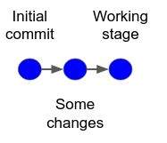
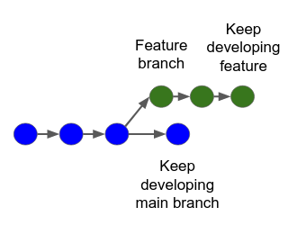
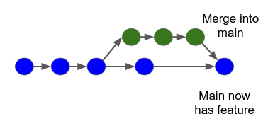

# Git demo
---
<div class="alert alert-danger">
    <br>
    <b>Please do this demo in a folder outside of the classes folder. Unfortunately, we do not have time to cover git submodules.</b>      
    <br>
    <br>
</div>

## Part 1: Initializing

1. Create a directory for the demo and check your __git__ configurations inside the directory.
```shell
git config --list
```
1.  If needed, configure git.
```shell
git config --global user.name “[firstname lastname]”
git config --global user.email “[valid-email]”
git config --global color.ui auto
```
1. Start the git flow.  
```shell
git init
```
1. Show the directories created inside the working directory. Git will track the code and store relevant info inside those directories.  
Mac Os
```shell
ls -la .
```

Windows
```shell
dir
```


---
## Part 1.1: Commiting changes
1. Create a simple file. For example, let's assume it contains a numpy array x, and a numpy function like np.sin as y. Save the file and return to the shell.
1. Verify what the tracking part is doing.
```shell
git status
```
1. Add the file you created to version control.
```shell
git add [file]
```
1. Double check your file.
```shell
git status
```
1. Make your initial commit.
```shell
git commit -m "Initial commit"
```
1. Triple check your file.
```shell
git status
```
1. Add a plotting capability to your file: plot (x,y) with matplotlib. Save the file and run it in the shell.
1. See that the file was changed.
```shell
git status
```
1. Stage the file in the local repository.
```shell
git add [file]
```
1. Make a second commit:
```shell
git commit -m "Added plotting capability"
```
1. Let's see how the tracking goes.
```shell
git status
```
1. Overview the commit history.
```shell
git log
```
---
## Part 1.2: Additional commands during the commit process

Sometimes there is a need to change what your are commiting. Git allows you to change the status of your added items and keep track of what you are updating in your code.

__Remember__: if you haven't made any changes, ```git status``` will not state changes have occurred.

1. Create another __empty__ file with a nice name like "another_function.py".
1. Add all your changes to staging with ```git add```.
1. But wait! We've done nothing in "another_function.py". Imagine if this was the case where you are adding a fle you believe would create confusion to a possible user (this is just an example). We want to remove it from the staging area.
```shell
git reset another_function.py
git status
```
1. You might also want to check the differences between what you are working on and what you have alread staged.
```shell
git diff
```
---
## Part 1.3: Summary so far: graphical representation of commits: [slides](git_workflow.pdf)

1. We start with a single function.

1. By initializing the repo, we create a staging area.

1. By ```adding``` a file to git, git is now tracking that file.

1. With a ```commit```, we create a snapshot of our files in the staging area.

---
## Part 1.4: Hosting

For this part, we will use a hosting service. Again, the hosting service is not the same as a central repository. 

While you have the instructions here for both hosting facilities, we will only cover __GitLab__ in the demo and in the course. For some companies, your __GitHub__ account and what is in it is more importante than your Linkedin account.

### 1.4.1 GitLab

Most companies have their own version control hosting service *on prem*, usually with [GitLab](https://about.gitlab.com/) (don't mix it with GitHub). GitLab also has its own hosting facilities.

1. Create a personal account in [GitLab](https://about.gitlab.com/).

1. Start a new project.

1. Create a blank project. Later you may wish to see if there is a remplate project that suits your needs.

1. Choose a project name and write a project description (you want your project well documented). Set visibility to __public__ and initialize project with a __README__.

1. Press __Create the project__.

1. Go to Part 2 of this demo.

### 1.4.2 Github

The hosting service for this demo is [GitHub](www.github.com).

1. Create a personal account in [GitHub](www.github.com) (for some companies, your GitHub account is more importante than your Linkedin account).

1. On GitHub, create a repository (repo). Call it a creative name, one that reflects what you are aiming to do with your project.

1. When you create your repo you may notice some additional options. We will ignore them for now.

1. Follow the instruction to "connect" your current diretory to the remote repository.

1. Once the setup is made, we now can ```push``` and ```pull```.

1. The action ```push``` will send your local changes to the remote hosting site.

1. The action ```pull``` will grab the remote information and will replace your local code.

---
## Part 2: Starting a repository with GitHub and GitLab


You may have noticed some additional checkboxes when you started your repository. We will now start a second repo. It is considerably easier to remotely start a repository to start developping a project. Let's check the fundamentals.

You will probably notice that [GitHub](www.github.com) is part social media platform.

Start a new repository, give it a flashy name and a great description. Make sure it is Public. 

---
## Part 2.1: The README.md file

As we have seen before, good documentation can make or break a project. Maybe your code gets addopted because you have doccumented it well. The REAMD.md file is written in Markdown and it is the visiting card of your project. Make sure you check it. By default, it is initialized with the description you gave the project.

As you can see [here](https://docs.github.com/en/github/creating-cloning-and-archiving-repositories/about-readmes), the README.md file shoud contain, among other things:

* Goal of the project.
* How to start using it.
* How to get help.
* Who are the people envolved in the project.

---
## Part 2.2: The Licenses

The License you choose to your project is one of its most important settings. By adding a license to your repo, you are claiming the work as your own and granting the users of your project some freedom to alter the contents of your project (or not).

The several types of license can be seen better described [here](https://en.wikipedia.org/wiki/Software_license).

For our case we want an Open-source licence, so we will [choose it with some help](https://choosealicense.com/).

---
## Part 2.3: The .gitignore file

When you have a project that handles data, you may wish to ignore some large data files, some images, or even some sensitive data to be included in a public repo. Sharing the code is not the same as sharing the data it handles. We must comply with GDPR!

Since we are coding in python, check the gitignore box, and select python.

The .gitingore file contains a list of exceptions that git will not track unless you force it to. We will briefly see what it does.

__Press Add Changelog__: choose *.gitignore* and apply the *python* template.

---
## 2.4: Cloning

Finally, we are ready to start using the repo. It comes with all configurations built-in. Go to a location in your hard drive where you wish to start developing, check your project clone info and run:

```shell
git clone [your clone info via https or ssh]
```

Some Win OS might have ssh disabled.

---
<div class="alert alert-info">
    <br>
    <b>Let's do an exercise! Back to the notebook, to where we left off.</b>      
    <br>
    <br>
</div>

1. The class must use pandas.
1. The class must have a ```read```, a ```plot```, and a ```save``` method.
1. The class must have a pandas dataframe where to store the data.
1. There is a suggestion for this exercise in the Functions folder, under online_file_reader.py
1. The file you save is a csv. Alter your .gitignore file so you don't track csv files.
1. Push your file into gitlab.

Extra:
1. Run Black on your file.
1. Run pylint on your file. Can you get 10?
1. Can you add error handling capabilities?


---
## Part 3: Collaborative workflow with Branches

We will now see where git really becomes us eful to a collaborative project.

### Part 3.1: Starting a new branch

With git, you can replicate your repo into __Branches__. A branch, in the beginning, is a copy of your code, tracked separately from your __MAIN__ branch. The latter is your initial state for the repo. To understand this, keep in mind that git workflows can be seen as graphs. Let's assume you initialized your repo, made some commits, and your code is ready to be used.



Remember, you want to use your code, and you want people to use it. But now, an issue arises: you want to add a feature to your code. But the feature might break your already existing code or have some bugs. To avoid "contamination", we will now create a branch called "feature".

<div class="alert alert-warning">
    <br>
    <b>Make sure you commited all your changes before creating a new branch.</b>      
    <br>
    <br>
</div>

On the shell:

```shell
git branch feature
```

At this moment, this is an exact copy of the contents of the __main__ branch. First we need to change into that branch. Remember, __checkout__ changes your working branch!

```shell
git checkout feature
```

Whilst we are still in the same directory, we are now working on a different "location". If we overwrite contents at this location we are not changing contents in the __main__ branch. We can always delete the __feature__ branch and re-create it, for instance. To get a better idea, create a file, commit it to your feature branch, and change branches. You will see the file is not in the new branch.

<div class="alert alert-warning">
    <br>
    <b>Until you commit a file to a certain branch, it will always appear in directory listings.</b>      
    <br>
    <br>
</div>

Now we go back to our __feature__ branch and we start developping... a new feature!

<div class="alert alert-warning">
    <br>
    <b>Exercise: Do a simple change to the OnlineReader class such as a cosmetic change to the "plot" method.</b>      
    <br>
    <br>
</div>



---

### Part 3.2: Merging Branches

You finally finished your new feature. You tested it, you linted the code. It is ready to be a worthy addition to the project, i.e., the main branch. We now need to merge branches.



There are two ways ways of doing this, depending how you are working. If branching locally, you do it locally:

```shell
git checkout master
git merge feature
```

---
### Part 3.3: Pushing changes

If you use a hosting site, you can __push__ your changes. You may receive instructions on how to merge branches as you __push__, depending on the software package you are using and where you are on the DAG.

Merging on a hosting site has the added bonus of providing complex journaling and logging assistance. When you create a project on a hosting site with colleagues, __roles__ can be assigned to your colleagues. Some may be only developers. Others can be managers. You can also assign the merge review process to a colleague. When you merge a branch via the hosting site, you can delete the feature branch, you can leave it be, etc..

The possibilities are vast, and features keep getting added every day.

---

### Part 3.4: Reverting

Reverting changes on a git project is a dangerous thing. We will not cover it in this demo. Going backwards on a DAG structure destroys the purpose of using a DAG structure in the first place. Still, if you want to do it, you checkout into the desired DAG location.

```shell
git checkout [hash of wanted commit]
```

Or doing a hard reset:

```shell
git reset --hard [hash]
```
 
Use these only when you are sure you are not breaking anything substantial.

---

## Part 4: Final thoughts

* __When to commit changes?__ Be reasonable. Commiting too often will make it harder for you to pinpont the origin of a possible problem. Sparse commits will have too many changes between them. Commits are like save games.
* __How to orchestrate changes between developers__? This is a human factor. It is a matter of good communication.
* __How to master my git skills?__ Break stuff. Try to recover it.